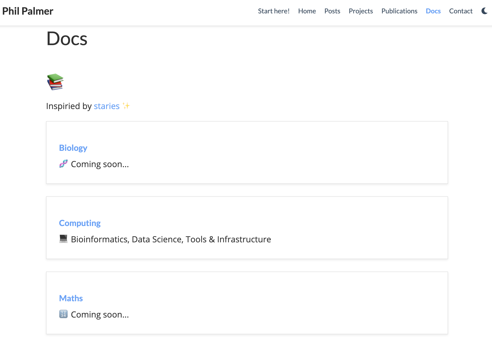

# docs :books:

Documentation for the things that I learn

To see a rendered version go to: https://philpalmer.github.io/blog/documentation/

If you think anything is wrong or can be improved please don't hesitate to submit a PR

## Bioinformatics

<a href="https://github.com/PhilPalmer/docs/blob/master/computing/conda.md" target="_blank"> Conda</a>

<a href="https://github.com/PhilPalmer/docs/blob/master/computing/nextflow.md" target="_blank"> Nextflow</a>

## Data science

<a href="https://github.com/PhilPalmer/docs/blob/master/computing/machine-learning.md" target="_blank">:robot: Machine learning</a>

<a href="https://github.com/PhilPalmer/docs/blob/master/computing/python.md" target="_blank"> Python</a>

<a href="https://github.com/PhilPalmer/docs/blob/master/computing/r.md" target="_blank"> R</a>

## Tools

<a href="https://github.com/PhilPalmer/docs/blob/master/computing/bash.md" target="_blank"> Bash</a>

<a href="https://github.com/PhilPalmer/docs/blob/master/computing/docker.md" target="_blank"> Docker</a>

<a href="https://github.com/PhilPalmer/docs/blob/master/computing/git.md" target="_blank"> Git</a>